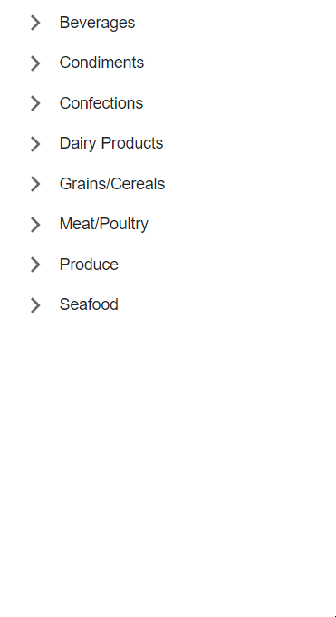

<!-- default badges list -->
[](https://supportcenter.devexpress.com/ticket/details/T1194802)
[](https://docs.devexpress.com/GeneralInformation/403183)
<!-- default badges end -->
# Tree View for Blazor - How to load child nodes on demand (lazy loading)

This example binds our DevExpress Blazor [TreeView](https://docs.devexpress.com/Blazor/DevExpress.Blazor.DxTreeView) to a data source and uses the [DxTreeViewDataMapping](https://docs.devexpress.com/Blazor/DevExpress.Blazor.DxTreeViewDataMapping) component to load child nodes on demand.



## Implementation Steps

1. Install the [Microsoft.EntityFrameworkCore.Proxies](https://www.nuget.org/packages/Microsoft.EntityFrameworkCore.Proxies/) NuGet package and call the `UseLazyLoadingProxies` method to enable [lazy load functionality](https://learn.microsoft.com/en-us/ef/core/querying/related-data/lazy#lazy-loading-with-proxies).

    ```cs
    builder.Services.AddDbContextFactory<NorthwindContext>((sp, options) => {
        var env = sp.GetRequiredService<IWebHostEnvironment>();
        var dbPath = Path.Combine(env.ContentRootPath, "Northwind.db");
        options
            .UseLazyLoadingProxies()
            .UseSqlite("Data Source=" + dbPath);
    });
    ```

2. Set the [DxTreeview.LoadChildNodesOnDemand](https://docs.devexpress.com/Blazor/DevExpress.Blazor.DxTreeView.LoadChildNodesOnDemand) property to `true` to activate lazy data loading in `DxTreeView`.

3. Add a [DxTreeViewDataMapping](https://docs.devexpress.com/Blazor/DevExpress.Blazor.DxTreeViewDataMapping) component and use its [HasChildren](https://docs.devexpress.com/Blazor/DevExpress.Blazor.Base.DxTreeViewDataMappingBase.HasChildren) property to specify whether a node has child nodes before loading them from the data source.

    ```razor
    <DxTreeView Data="@Data" LoadChildNodesOnDemand="true">
        <DataMappings>
            <DxTreeViewDataMapping Text="@(nameof(Category.CategoryName))"
                                   Children="@(nameof(Category.Products))"
                                   HasChildren="@(nameof(Category.HasProducts))" >
            </DxTreeViewDataMapping>
            <DxTreeViewDataMapping Level="1" Text="ProductName"/>
        </DataMappings>
    </DxTreeView>
    ```

## Files to Review

- [Index.razor](CS/Pages/Index.razor)
- [Program.cs](CS/Program.cs)
- [Category.cs](CS/Data/Northwind/Category.cs)

## Documentation

- [DxTreeview - Load Child Nodes on Demand](https://docs.devexpress.com/Blazor/DevExpress.Blazor.DxTreeView?#load-child-nodes-on-demand)
- [Lazy Data Loading](https://learn.microsoft.com/en-us/ef/core/querying/related-data/lazy)

## More Examples

- [Grid for Blazor - How to bind the component to data with Entity Framework Core](https://github.com/DevExpress-Examples/blazor-dxgrid-bind-to-data-with-entity-framework-core)]
